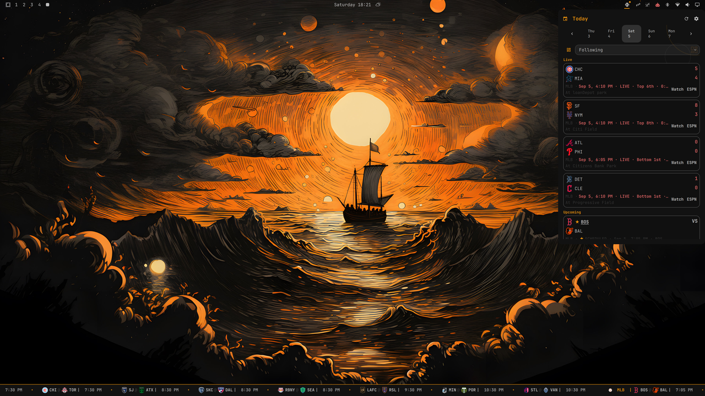

# Sportray

Live sports scores in your Omarchy bar.



Sportray is a native Omarchy Quattro `bar-widget` for checking a selected day's
games without opening a separate application. Click the compact bar widget to
open a favorites-first, keyboard-friendly scores panel with a bounded sport
chooser, light date carousel, grouped score slate, and one settings hub.

At a glance:

- **Favorite-first** — Following puts your teams and their live games first.
- **Eight leagues** — NHL, NFL, MLB, NBA, NCAA Football, NCAA Men's Basketball,
  Premier League, and MLS are available from one chooser.
- **No account or API key** — Scores, preferences, and alerts stay on your
  machine; Sportray has no backend or telemetry.

## Features

- NHL, NFL, MLB, NBA, NCAA Football, NCAA Men's Basketball, English Premier League, and MLS scoreboards
- Scheduled, live, intermediate, final, stale, empty, and unavailable states
- Favorite-team selection with canonical league/team identities
- A Following home for favorite-team games plus one stable destination per league
- Separate enabled and followed-league intents, with bounded followed-first
  navigation and reorder controls
- Grouped standings on ESPN-backed and NHL league destinations, with missing
  provider fields shown as neutral blanks and one-click favorite-team toggles
- A five-day date carousel with previous/next-day navigation and a Today reset
- A bounded calendar view behind the panel header that renders a vertically
  scrolling week stream with adjacent-month dates, Today, bounded game counts,
  favorite markers, and explicit unknown-versus-known-empty states; reaching
  either edge advances the month window automatically
- Empty league days keep their empty message and offer the next scheduled game
  as a one-click jump to that league day
- Loaded game rows open a local game-details drill-down from whole-row
  activation, and the labeled source action opens the ESPN gamecast, MLB.com
  gameday, or NHL.com gamecenter page
- Upcoming ESPN-backed games show the bookmaker line (spread details and
  over/under, attributed to the provider such as DraftKings) on the score
  card and in the game-details drill-down, projected from the same fetched
  scoreboard snapshot with no extra request
- Game cards show the event venue and use a restrained home-team color tint,
  with neutral fallbacks when either field is unavailable
- Favorite-aware bar priority and pinned favorite games in league views
- Automatic ambient bar modes: compact icon presentation on horizontal and
  vertical bars, with a color status indicator and score details on hover
- Provider-friendly adaptive polling, bounded date caches, and one in-flight
  request per league
- Desktop notifications for favorite game starts, score changes, finals,
  optional 30-minute-window pregame reminders, and opt-in close-game alerts
- Temporary one-game watches from score rows and game details, with bounded
  expiry and the same deduplicated notification safety path as favorites
- First-fetch suppression and bounded, restart-safe notification deduplication
- Persistent league, favorite, and notification preferences
- Theme-aware layout for top, bottom, left, and right bars
- The panel anchors to its tray button and the host clamps it to the available
  screen edge, while center placement remains centered
- Keyboard navigation, visible focus, Escape-to-close, and bounded dense panels
- No account, API key, Sportray server, or background daemon

The score panel opens on the local current date. Use the date carousel to move
back to completed slates or forward to upcoming games; each fetch and result
model is scoped to the selected local date. Closing the panel returns the
ambient bar indicator to the current date. `[` and `]` move one day while `T`
returns to today. On an ESPN-backed league destination, `S` toggles the
standings view. `C` toggles the calendar view: a vertically scrolling stream
of calendar weeks with adjacent-month dates, Today, bounded cached counts,
favorite markers, and neutral unknown days for dates not verified by a complete
cached snapshot. The stream keeps one month before and after the current month
in memory and loads the next month automatically at either edge. Select any cell to use the existing
selected-date fetch path; the selected day's games are listed below. The
month grid is built only from date caches already fetched, with an All
games/Favorites filter and `No games` only for known-complete empty days.
`F` toggles that filter while the calendar is open. `G` jumps directly to
the next cached day that has games without leaving the cache window. Calendar
game rows show an
explicit local-time label, open the same local detail drill-down, and Escape
returns from detail,
settings, and calendar before closing the panel.

Calendar hydration is bounded by provider evidence: when Calendar opens with
incomplete retained coverage, Sportray hydrates the visible month for NHL plus
the verified ESPN NFL, NBA, Premier League, and MLS range profiles through one
cancellable calendar owner. Complete retained coverage is a cache hit: opening
Calendar or returning to a covered month does not start another range fetch.
Each provider range is split into bounded seven-day requests and normalized
into complete local-date buckets, so known empty days do not require a click.
MLB and the NCAA leagues remain selected-day-only because their range behavior
is not yet admitted by the provider safety policy. NHL also retains its
low-frequency rolling 30-day background hydration.

After settings and the durable calendar cache finish loading, Sportray checks
the retained current-month coverage for those same admitted leagues. If it is
incomplete, one bounded sequential rehydration pass fills the missing calendar
state in the background and persists normalized day snapshots. The pass keeps
running if the panel or Calendar view closes, does not start a second fetch
owner, and is skipped after restart when coverage is already complete. While
it runs, the tray tooltip and Calendar show bounded progress; failed or partial
chunks leave unknown days honest and produce an incomplete-refresh notice.

When a selected-day-only league is enabled alongside hydrated leagues, its
missing non-selected dates do not make the hydrated calendar dates Unknown.
Calendar completeness is certified by the enabled leagues with admitted range
profiles; selected-day-only leagues still contribute games for dates already
present in their normal date cache.

When an enabled league has no games on the selected day, Sportray searches the
next bounded schedule window and shows the first upcoming game below the empty
state. Select **View day** to jump directly to that league day. The lookahead
uses ESPN's date-range scoreboard route and the NHL schedule route; it does not
change the current-day score model or notification date scope. NHL lookahead
follows only strictly later schedule dates and stops after eight requests;
malformed, non-progressing, or over-limit responses are cached as a safe empty
result.

The current league catalog is NHL, NFL, MLB, NBA, NCAA Football, NCAA Men's
Basketball, English Premier League, and MLS. NCAA Football is disabled by
default and uses ESPN's
canonical `college-football`
league ID. Its picker is a bounded FBS-focused catalog because ESPN's
provider team endpoint includes hundreds of lower-division and historical
records; canonical favorites still use `<league>:<providerTeamId>`. English
Premier League is also disabled by default, uses ESPN's canonical `eng.1`
league ID and `soccer/eng.1` route, and exposes a bounded 20-team current-
season catalog from the no-key team response. MLS is disabled by default, uses
ESPN's canonical `usa.1` league ID and `soccer/usa.1` route, and exposes a
bounded 30-team current-roster catalog from the no-key team response.
NCAA Men's Basketball is disabled by default, uses ESPN's canonical
`mens-college-basketball` league ID and `basketball/mens-college-basketball`
route, and exposes a bounded 50-team provider-owned snapshot from the current
no-key team response. The current off-season smoke observed the 2026-27
regular-season metadata and 50 scheduled events; the snapshot is intentionally
not a full historical or lower-division catalog. Favorites use only
`mens-college-basketball:<providerTeamId>`; `ncaab` is not an alias.

## Install

On Omarchy 4, install and enable the public repository with:

```bash
omarchy plugin add https://github.com/joega/sportray.git --enable
```

The plugin ID is `io.github.joega.sportray`. To manage it after installation:

```bash
omarchy plugin enable io.github.joega.sportray
omarchy plugin disable io.github.joega.sportray
omarchy plugin remove io.github.joega.sportray
```

Sportray requires Omarchy 4 with the Quattro shell and the `curl` command
included by Omarchy. It makes direct HTTPS requests to ESPN, MLB StatsAPI, and
NHL data endpoints and uses Omarchy's notification helper when favorite-team
alerts are enabled. It does not install packages, request privileged access,
create a service, or overwrite user configuration.

The normal Omarchy removal command unloads Sportray and removes its plugin
checkout. It intentionally leaves the preferences file documented below in
place so a reinstall can retain the user's settings; users may remove that
state file separately if they want a complete preference reset.

The underlying shell bar-widget summon/toggle functions take an argument
object. The installed `omarchy-shell` wrapper supplies an empty `{}` when the
argument is omitted; Sportray keeps it explicit in its commands and helper:

```bash
omarchy-shell shell toggle io.github.joega.sportray '{}'
omarchy-shell shell hide io.github.joega.sportray
```

After `rescanPlugins`, widget registration may settle asynchronously before a
bar-widget can be summoned. This checkout has no automatic post-rescan caller;
run the external bounded helper when that sequence is needed:

```bash
omarchy-shell shell rescanPlugins
./scripts/summon-sportray-after-rescan.sh
```

The helper sends the summon IPC with `{}` and accepts only `ok` as success. It
tries at most five times with 250 ms spacing after unsuccessful results, then
exits nonzero with a concise error. It never calls `hide`, is not part of the
plugin runtime path, and does not change normal hide behavior.

When developing against an already-running bar widget, `rescanPlugins` and a
successful summon do not necessarily replace the existing widget instance.
Use `omarchy restart shell` when a QML change is not visible in the open
widget, then summon Sportray again. This is an installed Omarchy bar-widget
lifecycle boundary; it does not require a second Sportray process.

## Marketplace listing

Proposed listing copy:

> Follow your favorite teams with live scores, daily schedules, and alerts—right
> from the Omarchy bar.

Proposed category: **Widgets**. Existing tags: `bar`, `quickshell`. Suggested
discovery tag: `sports`, if the submission form accepts new tag proposals.

The next assigned release candidate is `1.0.0-rc.8`. This checkout contains
unreleased hardening changes after the last tagged `1.0.0-rc.7`; the existing
tag remains unchanged, and no release date is asserted. The owner captured
`preview.png` personally and confirmed permission to submit it as shown,
including the visible provider and team marks. A GitHub Release and
Marketplace submission are separate publication steps.

## Settings and state

Open the panel's **Settings** action to choose **Sports & leagues**, **Favorite
teams**, or **Notifications**. Sports & leagues keeps **Enable** separate from
**Follow**: enabling admits a league to score fetching and destinations, while
following promotes it on Following, the league chooser, and the calendar filter.
Followed leagues can be reordered with bounded **Move up** and **Move down**
actions; disabling a league removes it from the followed set atomically.
Favorite teams supports search, league filters,
selected-first ordering, resilient logo fallbacks, and keyboard navigation.
Notification preferences control game starts, score changes, game finals,
favorite-only pregame reminders, and favorite-only close-game alerts
independently. Pregame reminders are opt-in, consider only scheduled games on
the current local date within 30 minutes of start, and remain silent for
malformed or stale timestamps. Close-game alerts are opt-in, consider only
favorite games in the current local-date scoreboard while live or at
intermission, and fire once when valid normalized scores enter a tied or
one-score margin. Missing or malformed scores, non-favorite games, final or
scheduled games, and wider margins remain silent. Use **Send test
notification** in that destination to preview the Omarchy notification
channel; the preview works even when alerts are disabled and does not change
deduplication state. Escape or Back returns from a utility to the prior score
view before closing the panel.

Use **Watch** on a valid game row or in its local details view to add temporary
notification interest without favoriting either team. Watches are canonical by
`<league>:<providerGameId>`, capped at 32 records, and expire no later than 30
days after creation. Watching never starts a provider request or changes league
polling. A watch can be removed from the same action; malformed, expired,
disabled-league, ended-game, unsupported-schema, and full-capacity cases remain
unavailable with an explicit reason.

Sportray stores bounded schema-2 JSON outside the plugin checkout at. It may
include up to 32 normalized watched-game records; provider payloads and raw
provider fields are never persisted:

```text
~/.local/state/omarchy/settings/sportray.json
```

Favorite IDs use the form `<league>:<providerTeamId>`, so abbreviations are
never treated as team identity.

The plugin-owned `settings` directory is repaired to owner-only `0700`
permissions before the state file is opened. The state file is repaired to
owner-only `0600` permissions before use and after every atomic save. Shared
ancestors such as `~/.local/state` are not changed. If a required repair fails,
Sportray keeps the bounded in-memory defaults or current settings but does not
persist new state until the permission boundary is healthy. This repair uses
only the fixed system command paths `/usr/bin/mkdir`, `/usr/bin/chmod`, and
`/usr/bin/test`; it never logs the settings contents.

Sportray migrates valid schema-1 state to schema 2 on the next safe write,
preserving enabled leagues, followed leagues, canonical favorites,
notifications, transition deduplication, and watched games. Schema 2 adds the
bounded `watchedGames` state used by temporary game watches. If an older
Sportray release sees a schema-2 file, it must not rewrite it; downgrade by
restoring a schema-1 backup or removing the state file, understanding that
removal resets preferences.

If the existing state file declares a schema version newer than 2, Sportray
keeps that file opaque and unchanged for rollback. It uses safe schema-2
in-memory defaults so the panel remains available, skips startup recovery and
later persistence writes, and resumes persistence only after a compatible
state-file reload replaces the future-schema contents. No migration or raw
future-schema data is logged.

Provider-supplied team logos are accepted only over HTTPS from the reviewed
asset hosts `a.espncdn.com` and `assets.nhle.com`. Missing, malformed, or
unreviewed logo URLs keep the initials and neutral fallbacks, so team rows and
the favorite picker remain usable when an asset is unavailable.

## Data sources and privacy

NHL scores come from the NHL public scoreboard API. NFL, NBA, NCAA Football,
NCAA Men's Basketball, English Premier League, and MLS scores and team catalogs
come from ESPN's site JSON endpoints. MLB uses ESPN as its primary scoreboard
provider and has an ordered MLB StatsAPI fallback after repeated ESPN failures.
The fallback uses the key-free
`statsapi.mlb.com/api/v1/schedule?sportId=1&date=YYYY-MM-DD&hydrate=team,linescore`
route and is limited to the owner's accepted individual, non-commercial,
non-bulk use of MLB materials. ESPN's site API is an undocumented website
interface rather than a supported public developer contract; its response shape
or availability may change. The MLB StatsAPI is also an undocumented provider
interface and may change without notice. ESPN-backed league destinations use
ESPN's standings route when the standings view is opened. NHL standings use the verified
`api-web.nhle.com/v1/standings/now` response, grouped by conference and ordered
by the provider's conference sequence; tri-codes are resolved through the
bounded current-team catalog before favorites are exposed. Missing optional
metrics remain neutral blanks and unknown or missing tri-codes are rejected.
The EPL catalog is a bounded provider-owned snapshot
because the current team endpoint is season-shaped; it is not a persistence
boundary.
Provider-specific parsing is isolated behind the normalized Sportray model so
a provider change does not become a UI dependency. Standings rows use the same
canonical `<league>:<providerTeamId>` team identity as favorites and preserve
nulls for fields the provider omits.

Each valid game keeps its score, participants, status/timing, and venue on the
scoreboard card. Whole-row activation opens a local game-details drill-down for
that already loaded game: participants, status/timing, venue, the guarded
ESPN/MLB.com/NHL.com source action, and, when the provider snapshot supplies them, an
optional final outcome, bounded per-period scoring lines, bounded team
statistic rows (such as MLB hits and errors), and up to two labeled event links
when the provider snapshot itself supplies safe attributable pages — an ESPN
**Highlights** video page for completed or in-progress games or an ESPN
**Preview** article. Fields the
provider omits — including pre-event lines, non-MLB statistics, most NHL
detail, and broadcast streams (ESPN and NHL payloads carry station names only,
never stream URLs) — render as
neutral placeholders rather than implying box-score depth. The labeled
source action opens the provider's ESPN, MLB.com, or NHL.com game page in the
Omarchy browser. Sportray never fetches a second per-game endpoint; detail is
a projection of the scoreboard snapshot. ESPN event links are used when
supplied; otherwise Sportray builds the provider's standard game URL from the
normalized game ID.

Requests go directly from your computer to the configured sports data
providers. Sportray has no backend, account, analytics service, or telemetry.
It does not ask for API keys, upload preferences, or execute downloaded code.
The plugin uses only controlled `/usr/bin/curl`, `/usr/bin/mkdir`,
`/usr/bin/chmod`, `/usr/bin/test`, `/usr/bin/omarchy-launch-browser`, and
`/usr/bin/omarchy-notification-send` command paths documented by the current
Omarchy contract.

Sportray is currently tested only in the United States. ESPN and NHL.com
availability, including scoreboard and game-page access, may vary by region;
some leagues may be unavailable outside the U.S. We are working toward broader
regional coverage and welcome pull requests for additional data adapters,
providers, sports, and leagues.

Each score request retrieves one enabled league's complete slate for one date;
Sportray never requests each game separately. Successful league/date snapshots
are retained in a bounded five-date in-memory cache and in a durable normalized
per-league/per-day calendar cache under `~/.cache/sportray/calendar/`. The
durable cache keeps only the rolling 30 days before through 30 days after
today, at most 488 day files, and at most 8 MiB of serialized data. Writes are
atomic; a manifest makes startup reads bounded, malformed files are ignored,
and expired manifest entries are removed. A shell restart therefore reuses
already-fetched calendar days instead of hydrating them from the network. The
durable cache contains only successfully fetched complete day snapshots; it
does not create a new provider or background range-fetch owner. A scheduled
slate is not
requested again until ten minutes before its earliest game (with a 12-hour
maximum revalidation window for more distant schedules). Empty and completed
slates use six-hour windows, and historical slates use 24 hours. Opening the
panel, closing it, or changing favorites does not bypass a fresh cache; the
explicit Refresh action does.

Provider score and next-game responses are transport-limited to 2 MiB and are
also accumulated through a bounded stream admission guard. Responses with more
than 256 provider events are rejected before normalization. A rejected response
is isolated to its league and retains the last-good snapshot when one exists.

Each league fetch admits its request through an ordered per-league provider
fallback chain: NHL uses the NHL adapter, MLB uses ESPN followed by the MLB
StatsAPI adapter, and every other league uses the ESPN adapter. Three
consecutive failed responses put that provider into a 15-minute cooldown during
which the league stops issuing requests, keeps its last-good snapshot, and
shows the existing unavailable or stale state; healthy leagues are unaffected.
When the cooldown expires the provider receives another opportunity, and any
successful response clears its recorded failures. The chain is not a settings
field, and provider parsing stays inside the provider adapters.

Only the league whose data is due is fetched when the shared scheduler wakes.
Visible live slates update about every 20 seconds, hidden live favorites every
30 seconds, and other background live slates every two minutes. Repeated
provider failures back off from one minute to a maximum of 30 minutes. A small
per-session jitter spreads installations across time instead of synchronizing
requests. The separate next-game lookup runs only for the selected empty
league, and its result is cached across panel reopenings.

## Troubleshooting

Validate the checkout and inspect the running Quickshell instance with:

```bash
omarchy plugin validate /absolute/path/to/sportray
qs list --all
qs log --id <running-instance-id> --tail 100
```

If a provider is unavailable, its league remains isolated and shows a compact
unavailable or stale state; healthy leagues are retained. If the widget is not
visible, re-enable it and restart the shell using the current Omarchy commands.
Do not delete the state file unless you intentionally want to reset leagues,
favorites, and notification preferences.

## Development

Sportray is one native Quattro plugin. `BarWidget.qml` owns the bar widget and
its nested panel; there is no second Quickshell process. Provider adapters
normalize responses before QML sees them, and pure JavaScript behavior is
covered by sanitized fixtures. The panel preserves Omarchy's installed
`KeyboardPanel` overlay contract while reading the host's current bar region and
anchoring horizontal edge placements to the actual tray button. The host's
screen clamp keeps the card on-screen beneath that trigger. The installed host
currently supplies a short opacity fade; a consumer-configurable slide and card
surface-color API are not part of that contract.

From a checkout, run the deterministic suite and repository checks:

```bash
tests/run-js-tests.sh
git diff --check
omarchy plugin validate "$PWD"
```

On an Omarchy development machine, lint changed QML with the real shell import
path and inspect the current shell log. The installed shell's widget IPC uses
`toggle <id> '{}'` and `hide <id>`; older no-argument examples do not apply to
the current contract.

## License

Sportray is released under the [MIT License](LICENSE). See
[CHANGELOG.md](CHANGELOG.md) for release notes.
